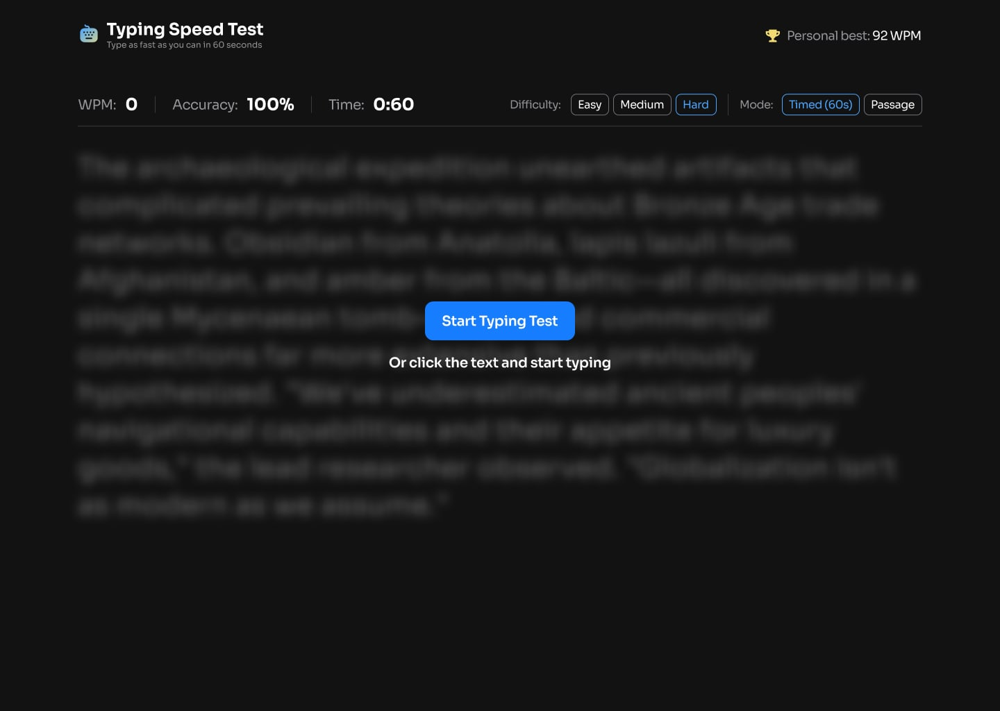
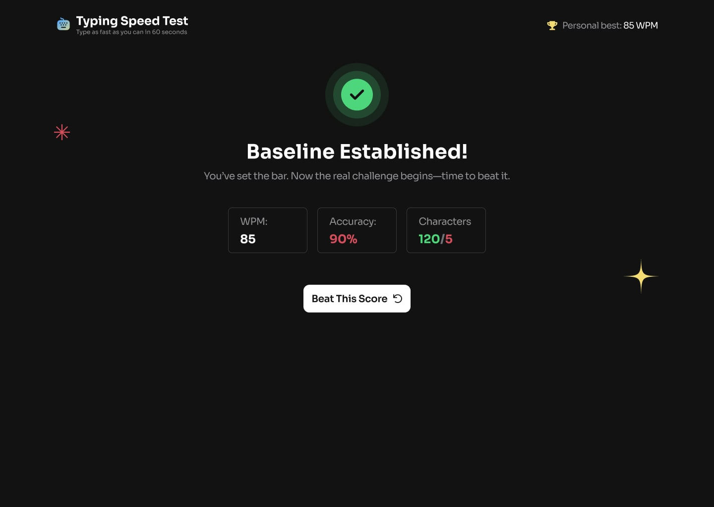
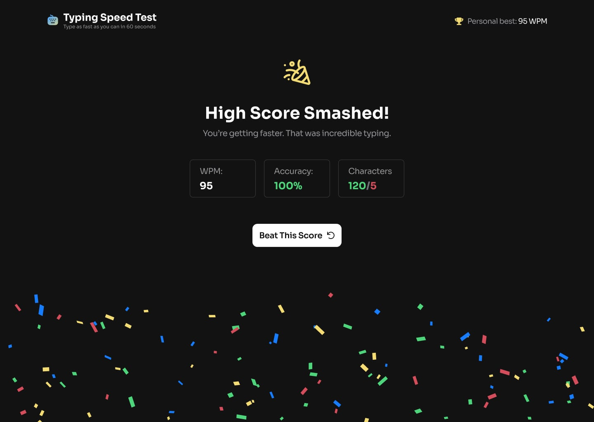
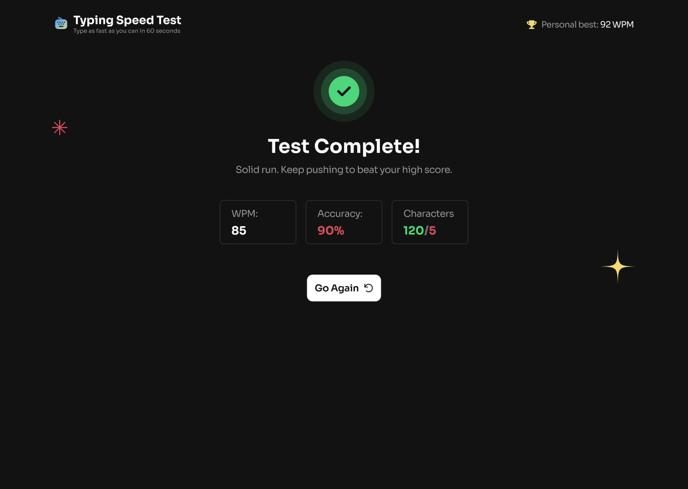

# Typing Speed Test Challange
  By: Stuepp.

## Brief

This is a code challange that I found on FrontEnd Mentor - [https://www.frontendmentor.io/challenges/typing-speed-test]

The challenge is to build out a typing speed test app and get it looking as close to a given design as possible.

I limited my self to not use any AI tool, and to avoid using libraries, and with the following stack:
Next.js TS Tailwind React.

Users should be able to:

Test Controls

- [-] Start a test by clicking the start button or by clicking the passage and typing
- [x] Select a difficulty level (Easy, Medium, Hard) for passages of varying complexity
- [ ] Switch between "Timed (60s)" mode and "Passage" mode at any time to get a new random passage from the slected difficulty.

Typing Experience

- [ ] See real-time WPM, accuracy, and time stats while typing
- [x] See visual feedback showing correct characters (green), errors (red/underlined), and [ ] cursor position
- Correct mistakes with backspace (original errors still count against accuracy)

Results & Progress

- [ ] View results showing WPM, accuracy, and characters (correct/incorrect) after completing a test
- [ ] See a "Baseline Established!" message on their first test, setting their personal best
- [ ] See a "High Score Smashed!" celebration with confetti when beating their personal best
- [ ] Have their personal best persist across sessions via localStorage

UI & Responsiveness

- [ ] View the optimal layout depending on their device's screen size
- [ ] See hover and focus states for all interactive elements

---

## Plus

1. Add multiple test durations (15s, 30s, 60s, 120s)
2. Add different text categories to type, such as famous quotes, song lyrics, or code snippets
3. Track WPM and accuracy over time using local storage
4. Add a keyboard heatmap showing errors and jeypress frequency
5. Create shareable result cards for socail media